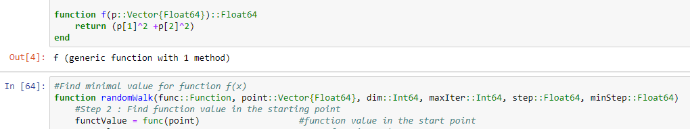

# RandomWalkInNDimensions
Numerical method of optimization of n-dimensional objective function.

## Table of contents
* [General info](#general-info)
* [Futures](#futures)
* [Technologies](#technologies)
* [Algorithm](#algorithm)
* [Setup](#setup)
* [How to use?](#how-to-use)
* [Example of use](#example-of-use)
* [Contact Website](#contact-website)

## General info
This project is implementation of Random Walk in n-dimensions in Julia Language
More info: https://en.wikipedia.org/wiki/Random_walk

## Futures
* Searching for a minimum function
* Support for the functions of many variables
* Adjustment of the accuracy tolerance of the result is possible
* Ability to change search ranges

## Technologies
Project is created with:
* Julia 1.0.3
* Jupyter Juliabox
* Distributions library 
(https://github.com/JuliaStats/Distributions.jl) - it is not necessary to import the library separately
`using Distibutions` should be enough.

## Algorithm
1. Begin by choosing point x1 with a certain step λ, the minimum step ἒ and the maximum number of iterations of N.
2. Find the value of the function at f1 = f (x1).
3. Set the iteration number i = 1
4. Generate a random number from the range [-1, 1] and create a vector u. Because the direction generated using the above equation favors diagonals hypercube limiting the field it is necessary to check whether the R vector is accepted only when R ≤ 1 occurs. If this is checked Vector condition is not distorted in any direction
5. Calculate the new vector x = x1 + u and the corresponding function value f = f (x)
6. Compare the value of f from f1. If f <f1 set new values x1 = x and f1 = f and return to step 3. If f ≥ f1 go to step 7.
7. If i ≤ N set a new iteration step i = i + 1 and go to step 4. If i> N, go to step 8.
8. Calculate the new reduced step length as λ = / 2. If the new step value is less than or equal to go to step 9. If you do not go back to step 4.
9. Complete the procedure by accepting Xopt ≈ x1 and Fopt = F

## Setup
To run this project, put it loccally in Julia IDE, or use Juliabox online.

## How to use?
All you have to do is enter the initial search parameters such as the function to optimize, starting point from which you can start the search, step and minimal step of search and maximal numer of iteration as shown below:
`f() - function to optimize; 
step - step of search; 
minStep - minimal step of search; 
maxIter - maximal number of iteration`
You can also leave the default values, but for better results it is recommended to adjust the parameters depending on the optimized function.

## Example of use

